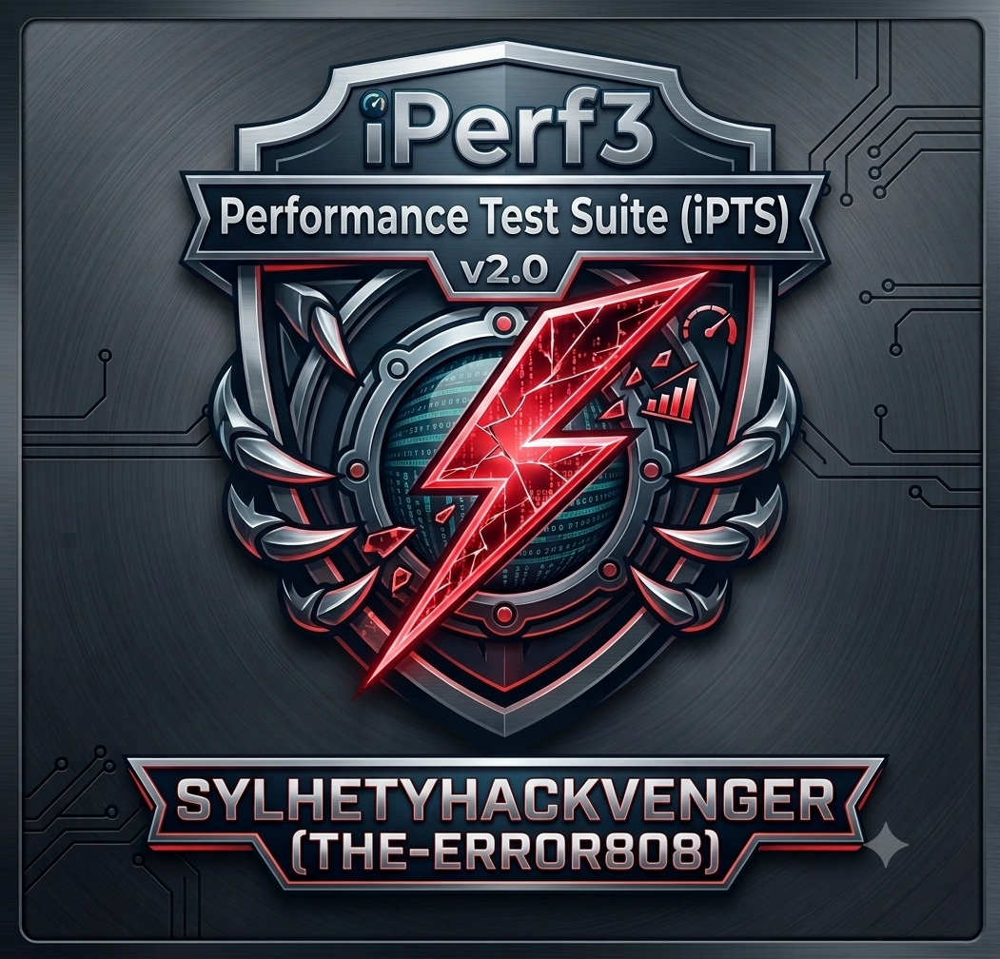
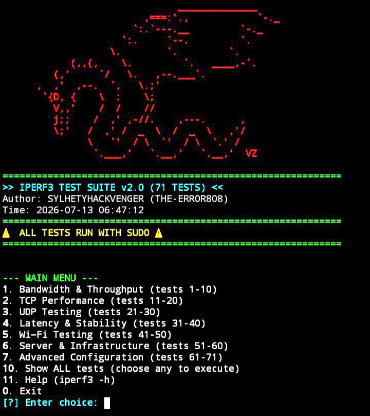

🚀 iPerf3 Test Suite v2.0

<p align="center">
  
</p>

A professional, interactive network performance analysis tool featuring 71 pre‑built iPerf3 commands across 7 categories.

---

📖 Overview

iPerf3 Test Suite v2.0 is a powerful, menu‑driven tool designed for authorised network troubleshooting, ISP verification, VPN testing, Wi‑Fi analysis, and capacity planning. It eliminates the need to remember complex iPerf3 syntax by providing 71 ready‑to‑use commands organised into logical categories.

With an interactive dashboard, optional port skipping, live verbose output, and a built‑in countdown timer, this tool transforms raw iPerf3 into an accessible, professional‑grade testing suite.

⚠️ For authorised testing only. Only use on systems you own or have explicit written permission to test.

---

✨ Features

· 71 Pre‑Built Tests – Covering Bandwidth, TCP, UDP, Wi‑Fi, Latency, Infrastructure, and Advanced scenarios.
· Interactive Menu – Browse by category or view all tests at once.
· Live Output – See the exact command and real‑time iPerf3 results as they happen.
· Optional Port – Press Enter to skip the -p flag and let iPerf3 use its default port (5201).
· Countdown Timer – A 3‑2‑1 countdown before each test for a polished experience.
· Sudo Integration – All commands run with sudo for full system access.
· Dragons ASCII Banner – A stunning cyber‑punk aesthetic right in your terminal.

<p align="center">
  
</p>

---

📊 Test Categories (71 Tests)

Category Tests Description
Bandwidth & Throughput 1–10 Measure download/upload, UDP throughput, WAN/LAN capacity, VPN & cloud performance.
TCP Performance 11–20 Max throughput, multi‑stream, congestion control, window scaling, stability, and retransmission analysis.
UDP Testing 21–30 Bandwidth, packet loss, jitter, VoIP/video simulation, packet size effects, and router behaviour.
Latency & Stability 31–40 Throughput variation, consistency, unstable links, intermittent problems, long‑running tests, and peak‑hour performance.
Wi‑Fi Testing 41–50 2.4/5 GHz comparison, AP capacity, roaming, wireless throughput, weak areas, and multi‑stream loads.
Server & Infrastructure 51–60 NIC performance, data centre links, load balancer paths, firewall impact, router/switch throughput.
Advanced Configuration 61–71 Custom ports, IPv4/IPv6, interface binding, parallel streams, bidirectional tests, JSON export, and automation.

---

🛠️ Installation & Usage

Prerequisites

· Linux / macOS / Termux (Android)
· iperf3 installed (sudo apt install iperf3 or pkg install iperf3)
· Python 3.6+

Quick Start

```bash
git clone https://github.com/sylhetyhackvenger/iPTS_iperf3-TestSuite
cd iPTS_iperf3-TestSuite
chmod +x iPTS.py
sudo python3 iPTS.py
```

Menu Navigation

1. Choose a category (1–7) to browse tests in that group.
2. Select 10 to view all 71 tests and pick any to run.
3. Enter the required server IP (mandatory) and optional parameters (port, duration, etc.).
4. Press Enter to skip optional flags – the tool intelligently removes them.
5. Watch the live output and analyse the results.

---

<p align="center">
  
</p>


📜 Legal Disclaimer

This tool is for educational and authorised penetration testing only.
Unauthorised use against any network or system you do not own or have explicit permission to test is illegal. The author assumes no liability for misuse or damage caused. Use responsibly.

---

🤝 Contributing

Pull requests, feature suggestions, and bug reports are welcome. Please keep the tool educational and ethical.

---

📬 Contact

Author: SYLHETYHACKVENGER (THE-ERROR808)
For issues, please open a GitHub ticket.

---

Happy (Ethical) Testing! 🚀

---

